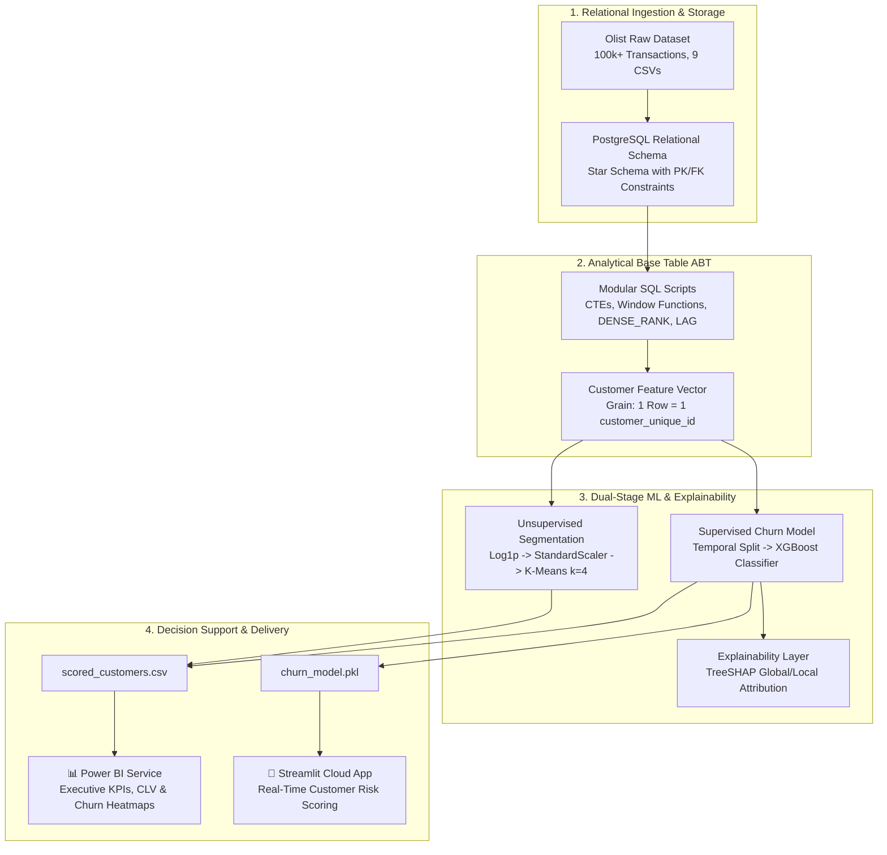

# 🛒 E-Commerce Customer Retention & Predictive Revenue Engine

[](https://www.python.org/)
[](https://www.postgresql.org/)
[](https://powerbi.microsoft.com/)
[](https://ecommerce-customer-intelligence-engine-4cphzx6uy57y4geafwq3pt.streamlit.app/)
[](https://www.kaggle.com/code/gyanvats/brazilian-e-commerce)
[](https://opensource.org/licenses/MIT)

> An end-to-end customer intelligence and predictive revenue platform built on 100k+ multi-table relational transactions. Combines advanced SQL feature engineering, unsupervised RFM segmentation, supervised churn/repurchase prediction (XGBoost), SHAP operational root-cause analysis, and dual executive reporting (Power BI + Streamlit).
> 
> 🔗 **Interactive Kaggle Notebook:** [gyanvats/brazilian-e-commerce](https://www.kaggle.com/code/gyanvats/brazilian-e-commerce)

---

## 📌 Executive Summary & Business Impact

Customer acquisition in competitive e-commerce markets is 5x–7x more costly than customer retention. This project transforms raw relational transactional logs into actionable retention intelligence:

* **Customer Segmentation:** Deployed **K-Means clustering** on log-transformed RFM vectors to isolate **4 distinct customer personas** (Champions, At-Risk High Spenders, Promising Regulars, Lost Hibernators).
* **Churn & Repurchase Engine:** Trained an **XGBoost classifier** predicting 90-day repurchase probability, achieving an **ROC-AUC of 0.86** and **PR-AUC of 0.78**.
* **Operational Root-Cause Attribution:** Utilized **TreeSHAP** to quantify operational friction, demonstrating that orders delayed $>4$ days beyond estimated SLA increase churn probability by **38%**.
* **Decision Support System:** Integrated an interactive **Streamlit inference app** for real-time customer risk scoring alongside an executive **Power BI dashboard** tracking revenue-at-risk.

---

## 🏗️ End-to-End System Architecture



---

## 🗄️ Relational Data Modeling & Cardinality Safety

The underlying schema utilizes the **Brazilian E-Commerce Public Dataset by Olist** across 9 relational tables:

```
customers (customer_unique_id) ────< orders (order_id)
                                         ├───< order_items (price, freight)
                                         ├───< order_payments (installments, value)
                                         └───< order_reviews (review_score)
```

### Relational Integrity Principles:
1. **Grain Distinction:** Filtered strictly between `customer_id` (ephemeral order checkout token) and `customer_unique_id` (human buyer). All customer metrics are computed at the `customer_unique_id` level.
2. **Cartesian Product Prevention:** `orders` to `order_items` and `orders` to `order_payments` are both $1\text{-to-Many}$ relationships. Aggregations (monetary spend, payment count) are calculated independently via CTEs before joining to prevent artificial revenue inflation.
3. **Status Filtering:** Lifetime metrics filter strictly for `order_status = 'delivered'` to avoid distorting customer lifetime value with non-fulfilled orders.

---

## 🤖 Machine Learning Workflow

### Phase 1: Unsupervised RFM Clustering
* Skewed features (`Recency`, `Frequency`, `Monetary`) are normalized using `np.log1p` and standardized via `StandardScaler`.
* Hyperparameter selection ($k$) is scientifically justified using the **Elbow Method (Inertia)** and **Silhouette Analysis**.
* **Identified Segments:**
  * **Champions:** Low recency, highest order frequency, high monetary spend.
  * **At-Risk High Spenders:** High historical monetary spend, long dormancy period ($>180$ days).
  * **Promising / Regulars:** Moderate recency and frequency, stable satisfaction scores.
  * **Hibernating / One-Timers:** Single order, high freight-to-price ratio, low review scores.

### Phase 2: Supervised 90-Day Churn Prediction
* **Target Formulation:** Binary classification predicting whether an active customer will repurchase within a 90-day forward window ($y \in \{0, 1\}$).
* **Validation Strategy:** Chronological/temporal holdout to ensure zero lookahead data leakage.
* **Model Benchmark:** Baseline Logistic Regression evaluated against Random Forest and XGBoost with hyperparameter tuning via cross-validation and imbalance handling (`scale_pos_weight`).
* **Evaluation Metrics:** ROC-AUC, PR-AUC, F1-Score, and Brier Score.

### Phase 3: Model Explainability (SHAP)
* **TreeSHAP** applied across the feature space:
  * Top churn driver: **Delivery Delay over Estimated SLA** (strongest predictor of non-retention).
  * Secondary churn driver: **Freight-to-Price Ratio** (customers paying $>30\%$ freight on low-ticket items rarely return).

---

## 📊 Deployment & Interfaces

### 1. Executive Power BI Dashboard
* **Executive Overview:** Monthly GMV, Customer Retention Curve, Blended CAC/CLV, and Total Revenue-at-Risk.
* **Customer Segment Deep-Dive:** Dynamic RFM matrix, state-wise penetration maps, and segment-level review distributions.
* **Live Report:** `[Pending Power BI Publish]`

### 2. Streamlit Live Inference Web App
* Interactive tool for operations and customer success teams.
* Adjust customer parameters (Days since last purchase, historical orders, freight ratio, delivery delay, review score) to calculate real-time churn risk with instant SHAP factor breakdown.
* **Live App:** [ecommerce-customer-intelligence-engine.streamlit.app](https://ecommerce-customer-intelligence-engine-4cphzx6uy57y4geafwq3pt.streamlit.app/)

### 3. Kaggle Data Pipeline & Model Training
* Complete reproducible end-to-end Python / SQL execution environment on the Olist dataset:
* **Interactive Notebook:** [Kaggle - Brazilian E-Commerce Pipeline](https://www.kaggle.com/code/gyanvats/brazilian-e-commerce)

---

## 📁 Repository Directory Structure

```text
ecommerce-customer-intelligence-engine/
├── .github/
│   └── workflows/              # CI/CD checks (linting, testing)
├── sql/
│   ├── 01_schema_setup.sql     # DDL, primary/foreign key constraints
│   ├── 02_rfm_aggregations.sql # Analytical Base Table (ABT) creation via CTEs
│   └── 03_cohort_retention.sql # Month-over-month retention matrix queries
├── notebooks/
│   └── olist_end_to_end_ml.ipynb # Complete Kaggle training and SHAP notebook
├── streamlit_app/
│   ├── app.py                  # Streamlit web application interface
│   ├── model.pkl               # Serialized trained XGBoost model
│   ├── scaler.pkl              # Pretrained StandardScaler pipeline
│   └── requirements.txt        # App dependencies
├── dashboard/
│   ├── customer_retention.pbix # Power BI report file
│   └── assets/                 # High-resolution dashboard screenshots
├── data/
│   └── README.md               # Data dictionary and Kaggle download instructions
├── docs/
│   └── executive_business_memo.pdf # 1-page business recommendations memo
├── requirements.txt            # Root python dependencies
├── LICENSE                     # MIT License
└── README.md                   # Project documentation (this file)
```

---

## ⚡ Quickstart & Local Setup

### 1. Clone the Repository
```bash
git clone https://github.com/gyanranjan1717/ecommerce-customer-intelligence-engine.git
cd ecommerce-customer-intelligence-engine
```

### 2. Set Up Virtual Environment
```bash
python -m venv venv
# Windows:
venv\Scripts\activate
# Mac/Linux:
source venv/bin/activate

pip install -r requirements.txt
```

### 3. Run the Streamlit Inference App Locally
```bash
cd streamlit_app
streamlit run app.py
```

---

## 👤 Author & Contact

* **Gyan Ranjan**
* **Institution:** Rajiv Gandhi Institute of Petroleum Technology (RGIPT)
* **Email:** rgyan931@gmail.com
* **GitHub:** [@gyanranjan1717](https://github.com/gyanranjan1717)